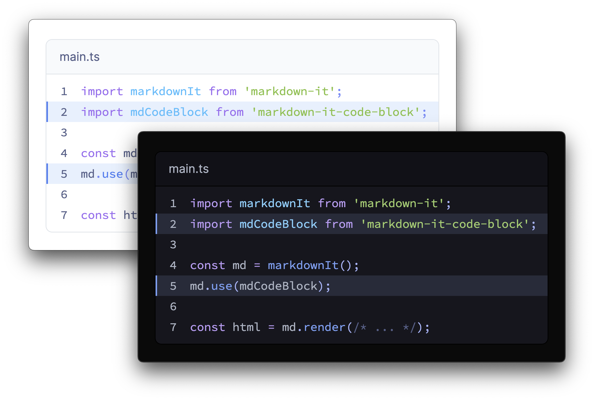

<p align="center">
  
</p>

# markdown-it-code-block

<p>
  
</p>

Code-block plugin for [markdown-it](https://github.com/markdown-it/markdown-it)

- ✅ Syntax highlight supported
- 🌙 Dark and light mode supported
- 🔥 Highlight specific line with ranges

👉 See more [screenshots](./docs/)

## Install

```shell
npm install markdown-it-code-block
```

## Usage

```js
import markdownIt from 'markdown-it';
import mdCodeBlock from 'markdown-it-code-block';

const md = markdownIt();
md.use(mdCodeBlock);

const html = md.render(/* ... */);
```

## Styling

Every style supports individual imports, so that you can import only what you need.

```js
// Light theme
import 'markdown-it-code-block/styles/light-theme.css';
import 'markdown-it-code-block/styles/light-theme-token.css';

// Dark theme
import 'markdown-it-code-block/styles/dark-theme.css';
import 'markdown-it-code-block/styles/dark-theme-token.css';

// Dark theme (for system preference)
import 'markdown-it-code-block/styles/dark-theme-media.css';
import 'markdown-it-code-block/styles/dark-theme-token-media.css';

// Base style
import 'markdown-it-code-block/styles/base.css';
import 'markdown-it-code-block/styles/base-token.css';
```

If you wish to override styles, refer to [source code](./styles/).

## Markdown

Supported markdown syntax are the following.

### Basic usage with title

````
```js [title]

```
````

### Title and highlight

````
```js [title] {1}

```
````

### Multiple highlights
Use `,` for multiple highlights and `-` for ranges.

````
```js [title] {1,3-5,7}

```
````

### Line number

````
```js [title] {1,3-5,7} line-number

```
````

## Under the hood

This plugin transforms the following markdown

````
```js [title] {1} line-number
console.log('example');
```
````

to the following HTML.

```html
<div class="md-code-block__container">
  <div class="md-code-block__title">title</div>
  <pre><code class="language-js"><span class="md-code-block__line-container" data-line-number="1" data-highlight="true"><span class="md-code-block__line"><span class="token console class-name">console</span><span class="token punctuation">.</span><span class="token method function property-access">log</span><span class="token punctuation">(</span><span class="token string">'example'</span><span class="token punctuation">)</span><span class="token punctuation">;</span></span></span></code></pre>
</div>
```

## License
See [LICENSE](./LICENSE)
